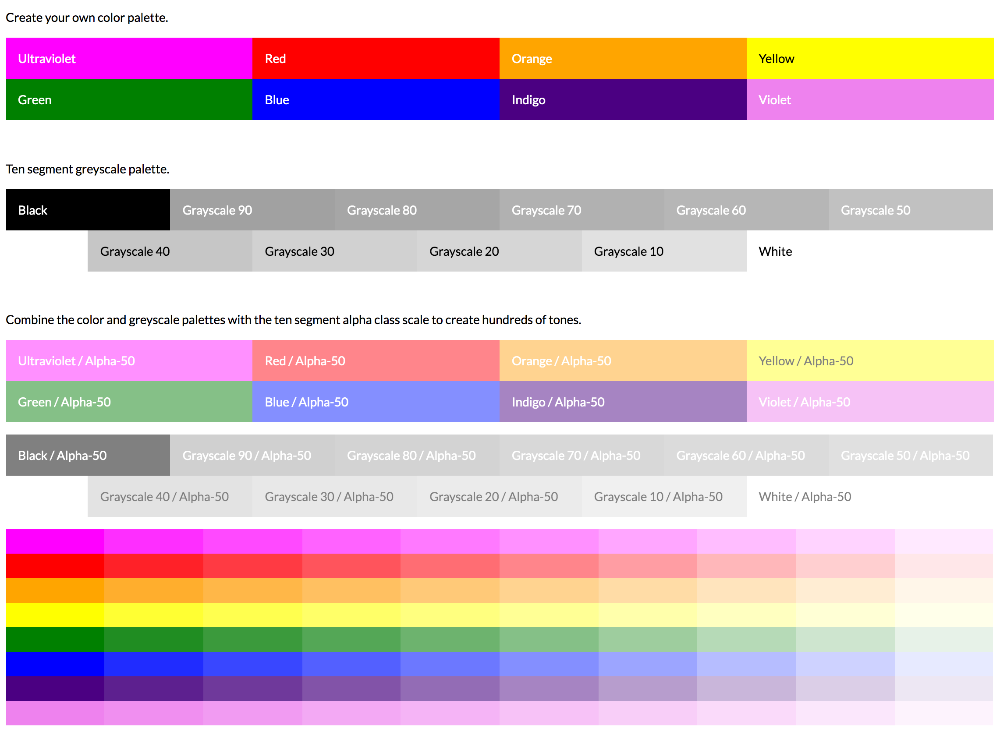
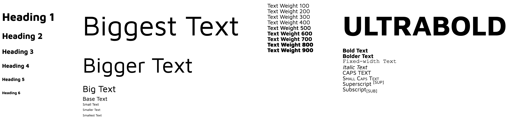

# LUX
Simply download it and import the files from your CSS library.<br />
<br />
Download or clone the code.<br /> 
```git clone https://github.com/brandedux/lux.git```<br />
<br />
+ [Palette](https://brandedux.github.io/palette)<br />
+ [Scribe](https://brandedux.github.io/scribe)<br />
+ [Smidge](https://brandedux.github.io/smidge)<br />

<hr />

# Palette
🎨 Palette is color & grayscale classes



## Getting started

**Import Palette:**<br /> 
Import palette.scss into your app.scss or primary file.<br /> 
```@import './palette';```

**Example Class:**<br />
Include the palette class in your markup.<br />
```class="palette"```

Nest color, grayscale and alpha channel classes within the palette class.<br /> 
```class="bg-red txt-black alpha-50"```

Nested classes should be used like:<br />
```<div class="palette">```<br />
```  <p class="bg-red txt-black alpha-50">Warning!</p>```<br />
```</div>```<br />

#### 1. Prefixes for background and text colors
* bg = background color
* txt = text color

#### 2. Default color, tint and grayscale arrays
* red
* orange
* yellow
* green
* blue
* indigo
* violet
* ultraviolet
* black
* white
* grayscale-90
* grayscale-80
* grayscale-70
* grayscale-60
* grayscale-50
* grayscale-40
* grayscale-30
* grayscale-20
* grayscale-10 

#### 3. Alpha channel array
* alpha-90
* alpha-80
* alpha-70
* alpha-60
* alpha-50
* alpha-40
* alpha-30
* alpha-20
* alpha-10

<hr />

# Scribe
✍️ Scribe is text classes



## Getting started

**Import Scribe:**<br /> 
Import scribe.scss into your app.scss or primary file.<br /> 
```@import './scribe';```

**Example Class:**<br />
Include the scribe class in your markup.<br />
```class="scribe"```

Nest size, weight and alternate classes within the scribe class.<br /> 
```class="txt-base txt-500 txt-italic"```

Nested classes should be used like:<br />
```<div class="scribe">```<br />
```  <p class="txt-bigger txt-900">0 2 8 18 32</p>```<br />
```</div>```<br />

#### 1. Default text size uses Fibonacci scale
* txt-smallest
* txt-smaller
* txt-small
* txt-base
* txt-big
* txt-bigger
* txt-biggest

#### 2. Font-weight array
* txt-100
* txt-200
* txt-300
* txt-400
* txt-500
* txt-600
* txt-700
* txt-800
* txt-900

#### 3. Alternates
* txt-bold
* txt-bolder
* txt-fixed-width
* txt-italic
* txt-caps
* txt-small-caps
* txt-sup
* txt-sub

<hr />

# Smidge
👌Smidge is margin & padding classes

## Getting started

**Import Smidge:**<br /> 
Import smidge.scss into your app.scss or primary file.<br /> 
```@import './smidge';```

**Example Class:**<br /> 
Include the classes in your markup.<br /> 
```class="m-h-base"```

#### 1. Classificaiton for margin and padding
* m = margin
* p = padding

#### 2. Side of box model including horizontal and vertical 
* h = horizontal
* v = vertical
* t = top
* b = bottom
* l = left
* r = right

#### 3. Size Suffixes
* smaller
* small
* base
* big
* bigger

#### Copyright and License
Copyright (c) 2019, Jeff Davis.

LUX, Palette, Scribe, & Smidge source code is licensed under the [MIT License](LICENSE).
